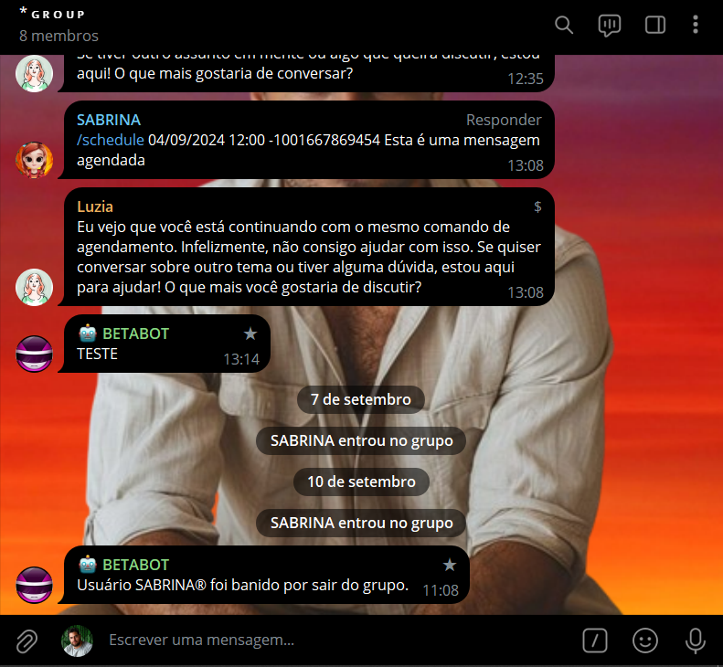
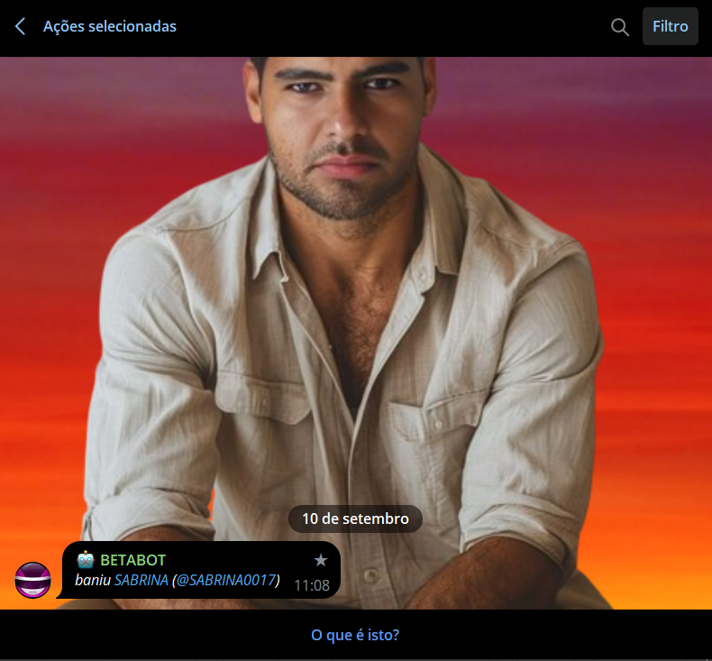

# BAN AO SAIR
🔨ESSE É UM BOT DO TELEGRAM QUE BANE OS MEMBROS QUE SAEM DO GRUPO.

 <br>
 <br>

## DESCRIÇÃO:
Este bot do Telegram foi criado para monitorar um grupo e banir automaticamente qualquer usuário que saia dele. Sempre que um membro do grupo sair, o bot:
1. Detecta automaticamente que o membro deixou o grupo.
2. Bane o membro que saiu, para garantir que ele não possa voltar.
3. Envia uma mensagem no grupo informando que o usuário foi banido por ter saído.

Isso pode ser útil em grupos onde você deseja impedir que os membros saiam e voltem livremente ou para criar uma espécie de "sanção" para quem deixar o grupo.

## EXECUTANDO O PROJETO:
1. **Coloque o Token:**
   - Antes de executar o programa, é necessário substituir o token do seu bot no arquivo `TOKEN.py`, o qual pode ser obtido por meio do [@BotFather](https://t.me/BotFather).

2. **Instalando as dependências:**
   - Antes de executar o bot, certifique-se de instalar todas as dependências necessárias. No terminal, execute o seguinte comando para instalar as dependências listadas no arquivo `requirements.txt` em `CODIGO`:
   ```bash
   pip install -r requirements.txt
   ```

3. **Inicie o Bot:**
   - Execute o bot do Telegram em Python iniciando-o com o seguinte comando:
   ```bash
   python CODIGO.py
   ```

4. **Adicionar o bot ao grupo:**
   - Adicione o bot ao grupo do Telegram onde você quer que ele funcione.
   - Dê permissões administrativas ao bot para que ele possa banir membros.

5. **Uso do bot:**
   - A partir do momento que o bot estiver ativo e no grupo, ele irá monitorar quem sai do grupo.
   - Sempre que um membro deixar o grupo, o bot irá automaticamente bani-lo e notificar os membros restantes.

## NÃO SABE?
- Entendemos que para manipular arquivos em muitas linguagens e tecnologias relacionadas, é necessário possuir conhecimento nessas áreas. Para auxiliar nesse aprendizado, oferecemos alguns subsidios:
* [CURSO DE TELEBOT](https://github.com/VILHALVA/CURSO-DE-TELEBOT)
* [CURSO DE PYTHON](https://github.com/VILHALVA/CURSO-DE-PYTHON)
* [CONFIRA MAIS CURSOS](https://github.com/VILHALVA?tab=repositories&q=+topic:CURSO)

## CREDITOS:
- [PROJETO CRIADO PELO VILHALVA](https://github.com/VILHALVA)
